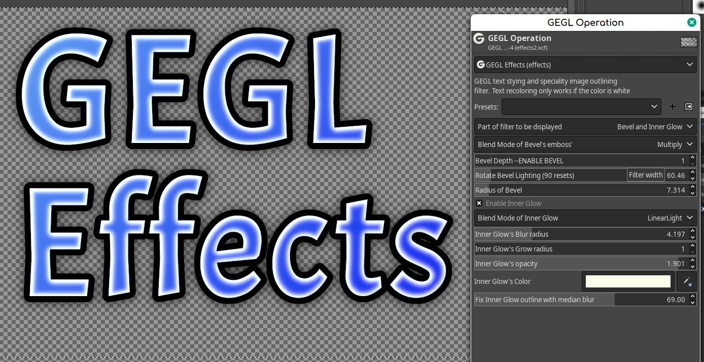
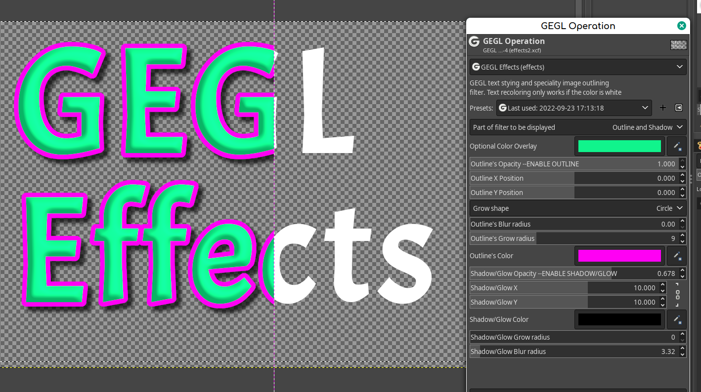
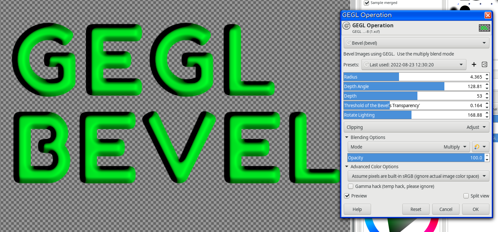
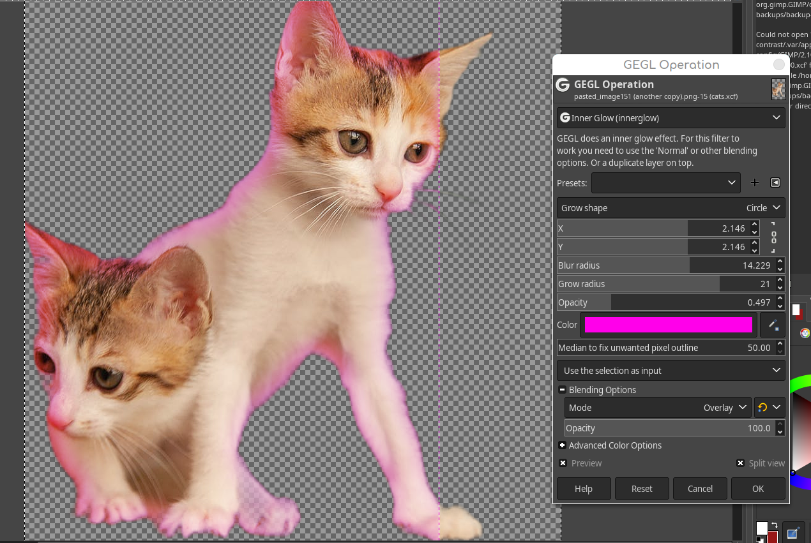

GEGL EFFECTS by Beaver. The GEGL filter you've been waiting for! 
=========
September 23 2022 update has given GEGL Effects a major revamp! It can now change internal blend modes for inner glow, gradient and bevel. As well as fragmentation of its list into three sectors "Outline and Shadow" "Bevel and InnerGlow" "Image and Gradient". This is the most professional and polished GEGL Effects has ever been.

GEGL effects is a GEGL plugin for Gimp that does layer effects. It may not be non-destructive but 
you can make presets and get live preview updates of your favorite text styles. 

GEGL Effects comes with two bonus filters called gegl:bevel and gegl:innerglow 
which are more useful on their own as they have more options. MOTE - It will NOT work without bevel.so and inner-glow.so


Instructions - If you choose not to use prebuilt binaries.
You must manually compile innerglow, bevel and effects and put the .so/dll files in gegl-0.4/plug-ins. Then restart Gimp and go to Gimp's GEGL operations. 

Once you get done compiling each operation go to its build direcory and get the
.so file and place it in /gegl-04/plugins. Click build_linux.sh to compile on Linux.







## Quick Guide 
Color change will only work correctly if the text is white. This is because it uses the color overlay on multiply blend mode that perfectly changes the color white to anything. If the color is something else it will be as if you are applying a multiply blend mode color overlay. 

You must slide opacity of Outline up to use the outline stroke. Sliding it down again hides it as if it were never there.

You must slide opacity of Shadow/Glow up to use Shadow and Glow option. Sliding it down again hides it as if it were never there.

Making X and Y 0.0 on Shadow can make a glow or extra stroke depending on the blur radius.

Bevel Bumpmap is disabled by default but sliding the opacity meter up enables it.

Bevel lighting angle is on 90 by default which is not an interesting option so consider playing with it..

Inner Glow and Gradient Overlay have checkboxes to enable them. Inner Glow will slow down GEGL Effects unless you have a really powerful machine.

Use Gimp's rectangle select around the text to speed things up. That way the filter only applies on part of the canvas instead of the entire canvas.

Inner Glow, Outline and Shadow can do a triple stroke effect if set to the right option but it is smarter to just use a designated filter like my custom gegl:color-trail which allows up to 5 strokes. To do something like that. 

## Instructions 
You must manually compile effects, innerglow, and bevel and put the .so/dll files in gegl-0.4/plug-ins. Then restart Gimp and go to Gimp's GEGL operations.

Once you get done compiling each operation go to its build direcory and get the
.so file and place it in gegl-04/plugins. Click build_linux.sh to compile on Linux.


## OS specific location to put GEGL Filter binaries 

Windows
 C:\\Users\<YOUR NAME>\AppData\Local\gegl-0.4\plug-ins
 
 Linux 
 /home/(USERNAME)/.local/share/gegl-0.4/plug-ins
 
 Linux (Flatpak)
 /home/(USERNAME)/.var/app/org.gimp.GIMP/data/gegl-0.4/plug-ins


## Compiling and Installing

### Linux

To compile and install you will need the GEGL header files (`libgegl-dev` on
Debian based distributions or `gegl` on Arch Linux) and meson (`meson` on
most distributions).

```bash
meson setup --buildtype=release build
ninja -C build

```

If you have an older version of gegl you may need to copy to `~/.local/share/gegl-0.3/plug-ins`
instead (on Ubuntu 18.04 for example).


### Windows

The easiest way to compile this project on Windows is by using msys2.  Download
and install it from here: https://www.msys2.org/

Open a msys2 terminal with `C:\msys64\mingw64.exe`.  Run the following to
install required build dependencies:

```bash
pacman --noconfirm -S base-devel mingw-w64-x86_64-toolchain mingw-w64-x86_64-meson mingw-w64-x86_64-gegl
```

Then build the same way you would on Linux:

```bash
meson setup --buildtype=release build
ninja -C build
```

Have fun BTFOing photoshop users.


