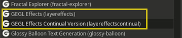

This is a stable yet continual updating version of GEGL Effects that can co-exist with default GEGL Effects. Presets from normal GEGL Effects will not work with this version and there is no guarantee that future versions 
will not break text styling presets. Every release will contain a optional roll back.
So you may want to download the latest version and just stick with it indefinitely. 


You are expected to also download GEGL InnerGlow, GEGL Bevel and  GEGL zzstrokebevelimage. The plugin will not work correctly without them.
In total you should have, gegleffectspending, zzstrokebevelimage, bevel and innerglow for this filter to work.  

This plugin will work alongside normal GEGLEffects as seen here.




## Directories to put binaries

Windows C:\Users<YOUR NAME>\AppData\Local\gegl-0.4\plug-ins

Linux /home/(USERNAME)/.local/share/gegl-0.4/plug-ins

Linux (Flatpak) /home/(USERNAME)/.var/app/org.gimp.GIMP/data/gegl-0.4/plug-ins


## Compiling and Installing

### Linux

To compile and install you will need the GEGL header files (`libgegl-dev` on
Debian based distributions or `gegl` on Arch Linux) and meson (`meson` on
most distributions).

```bash
meson setup --buildtype=release build
ninja -C build

```

If you have an older version of gegl you may need to copy to `~/.local/share/gegl-0.3/plug-ins`
instead (on Ubuntu 18.04 for example).


### Windows

The easiest way to compile this project on Windows is by using msys2.  Download
and install it from here: https://www.msys2.org/

Open a msys2 terminal with `C:\msys64\mingw64.exe`.  Run the following to
install required build dependencies:

```bash
pacman --noconfirm -S base-devel mingw-w64-x86_64-toolchain mingw-w64-x86_64-meson mingw-w64-x86_64-gegl
```

Then build the same way you would on Linux:

```bash
meson setup --buildtype=release build
ninja -C build
```


### Here are some more pics just to show off various text styles made with the Gimp Plugin GEGL Effects 
----------------
  CV can do everything the normal version can do and more.


## Inner Glow and Bevel as bonus stand alone plugins are also included. These plugins are used in GEGL Effects but do more as stand alones.


